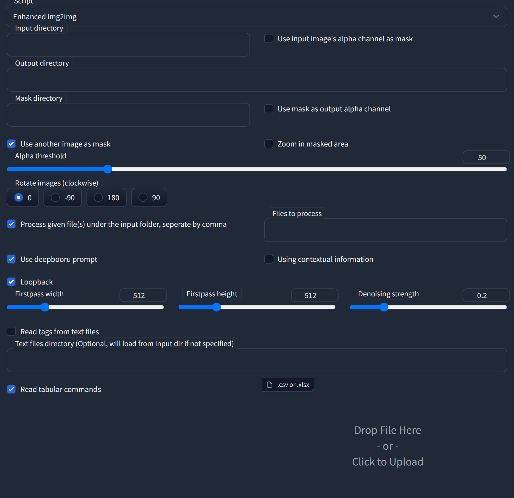
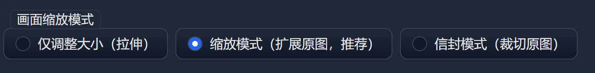

# Enhanced img2img

This is an extension for [AUTOMATIC111's WebUI](https://github.com/AUTOMATIC1111/stable-diffusion-webui), which supports batch processing and better inpainting.

## Install

Please refer to the [official wiki](https://github.com/AUTOMATIC1111/stable-diffusion-webui/wiki/Extensions) for installation instructions.

## Usage

### Enhanced img2img

To use Enhanced img2img, switch to the **"img2img"** tab and select **"enhanced img2img"** under the **"script"** column.

- **Input directory**: The folder that contains all the images you want to process.
- **Output directory**: The folder where you want to save the output images.
- **Mask directory**: The folder containing all the masks. This is not essential.
- **Use input image's alpha channel as mask**: If your original images are in PNG format with transparent backgrounds, you can use this option to create outputs with transparent backgrounds. Note: when this option is selected, the masks in the "**mask directory**" will not be used.
- **Use another image as mask**: Use masks in the "**mask directory**" to inpaint images. Note: if the relevant masks are blank images or no mask is provided, the original images will not be processed.
- **Use mask as output alpha channel**: Add the mask as an output alpha channel. Note: when the "**use input image's alpha channel as mask**" option is selected, this option is automatically activated.
- **Zoom in masked area**: crop and resize the masked area to square images; this will give better results when the masked area is relatively small compared to the original images.
- **Alpha threshold**: The alpha value to determine background and foreground.
- **Rotate images (clockwise)**: This can improve AI's performance when the original images are upside down.
- **Process given file(s) under the input folder, separated by comma**: Process certain image(s) from the text box to the right to it. If this option is not checked, all the images under the folder will be processed.
- **Files to process**: Filenames of the images you want to process. It is recommended to name your images with a digit suffix (e.g. `000233.png, 000234.png, 000235.png, ...` or `image_233.jpg, image_234.jpg, image_235.jpg, ...`). This way, you can use `233,234,235` or simply `233-235` to assign these files. Otherwise, you need to give the full filenames like `image_a.webp,image_b.webp,image_c.webp`.
- **Use deepbooru prompt**: Use DeepDanbooru to predict image tags. If you have input some prompts in the prompt area, it will append to the end of the prompts.
- **Using contextual information**: This can improve accuracy (maybe) if tags are present in both current and next frames' prediction results.
- **Loopback**: Similar to the loopback script, this will run input images img2img twice to enhance AI's creativity.
- **Firstpass width** and **firstpass height**: AI tends to be more creative when the firstpass size is smaller.
- **Denoising strength**: The denoising strength for the first pass. It's better to keep it no higher than 0.4.
- **Read tags from text files**: This will read tags from text files with the same filename as the current input image.
- **Text files directory**: Optional. It will load from the input directory if not specified.
- **Use csv prompt list** and **input file path**: Use a `.csv` file as prompts for each image. One line for one image.

### Multi-frame rendering

To use Multi-frame rendering, switch to the **"img2img"** tab and select **"multi-frame rendering"** under the **"script"** column. This should be used with ControlNet. For more information, see [the original post](https://xanthius.itch.io/multi-frame-rendering-for-stablediffusion).

- **Input directory**: The folder that contains all the images you want to process.
- **Output directory**: The folder where you want to save the output images.
- **Initial denoise strength**: The denoising strength of the first frame. You can set the noise reduction strength of the first frame and the rest of the frames separately. The noise reduction strength of the rest of the frames is controlled through the img2img main interface.
- **Append interrogated prompt at each iteration**: Use CLIP or DeepDanbooru to predict image tags. If you have input some prompts in the prompt area, it will append to the end of the prompts.
- **Third column (reference) image**: The image used to be put at the third column.
  - None: use only two images, the previous frame and the current frame, without a third reference image.
  - FirstGen: Use the **processed** first frame as the reference image.
  - OriginalImg: Use the **original** first frame as the reference image.
  - Historical: Use the second-to-last frame before the current frame as the reference image.
- **Enable color correction**: Use color correction based on the loopback image. When using a non-FirstGen image as the reference image, turn on to reduce color fading.
- **Unfreeze Seed**: Once checked, the basic seed value will be incremented by 1 automatically each time an image is generated.
- **Loopback Source**: The images in the second column.
  - Previous: Generates the frame from the previous generated frame.
  - Currrent: Generates the frame from the current frame.
  - First: Generates the frame from the first generated frame.
- **Read tags from text files**: This will read tags from text files with the same filename as the current input image.
- **Text files directory**: Optional. It will load from the input directory if not specified.
- **Use csv prompt list** and **input file path**: Use a `.csv` file as prompts for each image. One line for one image.

## Tutorial video (in Chinese)

## Credit

AUTOMATIC1111's WebUI - https://github.com/AUTOMATIC1111/stable-diffusion-webui

Multi-frame Rendering - https://xanthius.itch.io/multi-frame-rendering-for-stablediffusion
